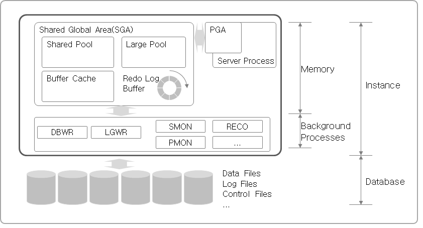

# 1. RDMS 및 Oracle 소개

## Oracle
- Oracle DBMS는 미국에 본사를 둔 Oracle사에서 공급하는 상용DBMS이다.
- Oracle이 제공하는 DBMS는 다양하고 강력한 기능으로 전 세계적으로 가장 높은 시장 점유율을 가지고 있으며 많은 기업에서 사용된다.
- 이런 특징으로 Oracle DBMS 전문인력에 대한 수요는 매우 높고 개발자들이 참조할 수 있는 Reference와 Commuity는 양과 질의 관점에서 잘 구축돼 있다.


Background Process: 명령어 셋

# 2. Oracle의 주요 개념

## Oracle Data Type

### 문자형 Data Type

- 문자 형태를 갖는 Data Type
- 문자 형태는 Data에 저장되는 자료 중 대부분을 점유하는 Type

    - varchar2  VARCHAR2(size [BYTE | CHAR])    //가변형 문자열 저장. 1~4000byte 까지 저장 가능.
    - nvarchar2 NVARCHAR2(size) National Character를 위한 가변 문자열 저장. 1~4000byte까지 저장 가능
    - char  CHAR[(size [BYTE | CHAR])]  고정된 길이 문자열 저장. 1~2000byte까지 저장 가능. 지정된 길이보다 짧은 길이의 자료가 입력될 경우 공백(space) 가 오른쪽에 추가돼 지정된 길이만큼 저장됨.
    - long  LONG    2GB 까지 저장 가능한 가변 길이 문자열 저장. 사용 및 관리상의 문제로 많이 사용하지 않으며 LOB 형태를 사용 할 것을 권함.
    - clob  CLOB    (4 GB -1)*DB_BLOCK_SIZE (8TB to 128TB) 까지의 문자열 저장 가능.

### 실습 2-1 varchar2 Type의 특성

```sql

SQL> drop table tab_test01;
drop table tab_test01
           *
ERROR at line 1:
ORA-00942: table or view does not exist


SQL> create table tab_test01
  2  (
  3    c1 varchar2(10)
  4    ,c2 varchar2(4000)
  5  );

Table created.

SQL>
SQL> insert into tab_test01(c1) values(dbms_random.string('X',10));
# 10byte의 문자열을 생성해 C1칼럼에 입력.
1 row created.

SQL> insert into tab_test01(c1) values(dbms_random.string('X',20));
insert into tab_test01(c1) values(dbms_random.string('X',20))
# 20byte의 문자열을 생성해 C1칼럼에 입력.
                                              *
ERROR at line 1: # 적재 가능한 최대 길이를 초과하므로 실패
ORA-12899: value too large for column "BO"."TAB_TEST01"."C1" (actual: 20,
maximum: 10)


SQL> select lengthb(c1) from tab_test01;

LENGTHB(C1)
-----------
         10

SQL> insert into tab_test01(c2) values(dbms_random.string('X',4000));
# 4000byte로 선언한 C2칼럼에 dbms_random Package의 string Function을 사용해 4000 byte를 생성해 입력

1 row created.

SQL> insert into tab_test01(c2) values(dbms_random.string('X',5000));

1 row created.

SQL> insert into tab_test01(c2) values(rpad('A',5000,'A'));
# varchar2 Type의 return값을 갖는 함수는 최대 4000byte 까지만 return 하기 때문에 오류가 발생하지 않는다.
1 row created.

SQL> select lengthb(c2) from tab_test01 where c2 is not null;

LENGTHB(C2)
-----------
       4000
       4000
       4000

```

C1 칼럼은 10byte, C2 칼럼은 varchar2 Type의 최대 길이인 4000 byte.

dbms_random Package의  string function은 지정한 개수 만큼의 문자열을 생성하고 varchar2 형태로 return 합니다.
