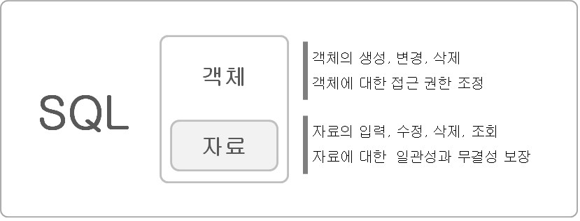
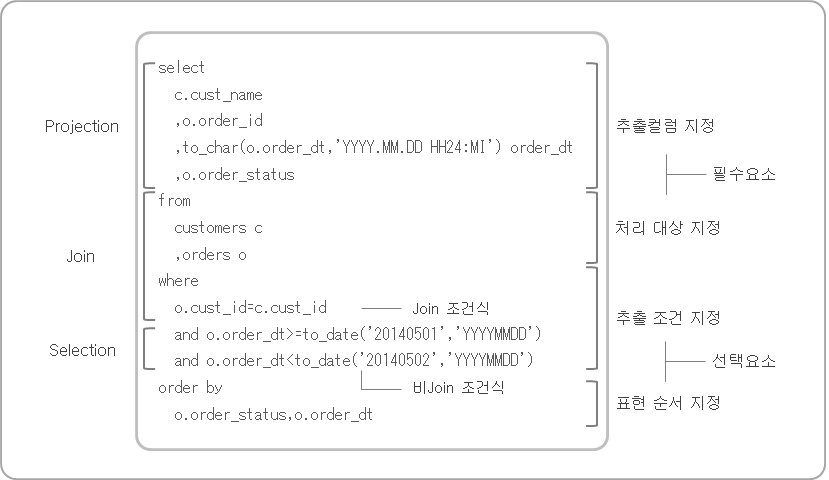
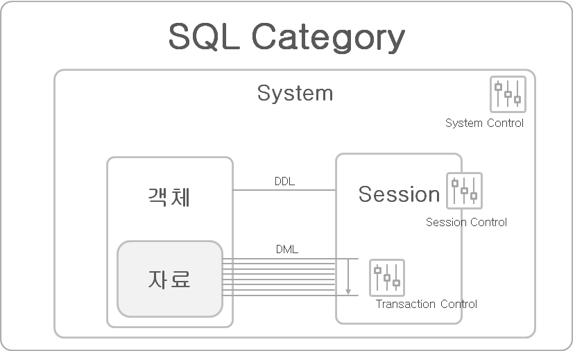

# 1.SQL

Sql은 Database에 정보를 저장/처리하기 위해 사용되는 선언적 언어를 말하며 대부분의 DBMS는 SQL 문장을 통해 자료에 대한 처리를 수행한다. 많이 알고 있는 Select, Insert, Delete, Update 문장을 통한 자료의 입출력 외에도 다음과 같은 역할을 수행한다.



sql문장은 수행 목적에 따라 다양한 구문과 형태가 존재한다.



sql문장은 관계대수의 관점에서는 필요한 칼럼을 지정하는 Projection, 조건을 충족시키는 자료만 선정하는 Selection, 원천자료들로부터 의마상 관련된 자료를 결합해 추출하기 위한 Join으로 크게 구성된다.
Sql문장은 Data Source를 지정하고 추출해 보고 싶은 칼럼을 지정하고 데이터의 추출조건을 지정하면 데이터에 어디에 어떤 방식으로 존재하는 것과 관계없이 해당 데이터를 물리적으로 검색해 사용자에게 제공해 줍니다. 사용자는 데이터의 물리적 위치를 알 필요도 없고 어떤 방식으로 해당 데이터가 추출되는지 알 치료가 없다. 이런 방식을 통해 데이터에 대한 물리적 독립성이 보장되며 데이터의 처리과정이 단순해진다는 이점을 제공해주며 이런 특징으로 sql을 비절차형 언어 라고 부르기도 한다.

Oracle의 경우 Select문장은 필수 요소와 선택 요소로 나눌 수 있다. 필수 요소는 Select문장이 수행되기 위해 반드시 존재해야 하는 요소를 의미하며 Select List와 From 절이 필수 요소가 된다. DBMS에 따라서 단순 연산이나 함수 호출의 경우 FROM절이 없이도 수행 가능하다.


SQL문장은 수행하려는 작업의 특성에 따라 몇가지 종류로 나뉘어 볼수 있다.



- Data Definition Language
    - 스키마 객체를 생성, 변경, 제거하는데 사용되는 문장
    - CRRATE, DROP, ALTER
    - Data Dictionary를 이용한 모든 자료 삭제(TRUNCATE)
    - 권한의 부여, 회수 (GRANTE, REVOKE)
    - 접근 기록 수행 시작 및 종료(AUDIT, NOAUDIT)
    - 주석의 추가(COMMENT)

- Data Manipulation Language
    - 스키마 객체에 대한 자료의 입력, 갱신, 삭제하는데 사용되는 문장
    - Select
    - INSERT, UPDATE, DELETE
    - MERGE 단일 sql문장으로 조건에 따라 립력, 갱신, 삭제.
    - EXECUTION PLAN 실행계획 생성
    - LOCK TABLE table에 대한 락 설정

- Transaction Control 문장.

- Session Control 문장

- System Control 문장

SQL문장을 통해 데이터 베이스의 모든 작업이 이루어지는 만큼 Sql문장의 기능을 이해하고 사용하는 것은 매우 중요하다. 실무에서는 데이터베이스를 사용하는 역할만큼만 필요한 권한을 받게 되고 그에 따라 사용 가능한 종류가 결정된다. 예를 들어 단순 개발자 DML문장과 Transaction Control 문장 정도를 사용할 수 있으며 데이터베이스 관리자라면 모든 종류의 SQL문장을 사용할 수 있는 권한을 가지게 된다.

### 실습 3-1. DDL문장
```sql
drop table tab_test02;
drop table tab_test01;

create table tab_test01
(
  prod_id number
  ,prod_name  varchar2(100)
  ,price  number
  ,stock_cnt  number
);

create unique index tab_test01_pk on tab_test01(prod_id);
alter table tab_test01 add constraint tab_test01_pk primary key(prod_id);

comment on table tab_test01 is 'TEST Table 01';
comment on column tab_test01.prod_id is '상품ID';
comment on column tab_test01.prod_name is '상품이름';

create table tab_test02
(
  order_id  number
  ,prod_id  number
  ,quantity number
);

create unique index tab_test02_pk on tab_test02(order_id,prod_id);
alter table tab_test02 add constraint tab_test02_prod_id_fk foreign key(prod_id) references tab_test01(prod_id) on delete set null;

```

Data가 입력될 공간을 만들고 삭제하고 제약조건을 부여하거나 주석을 다는 모든 작업들은 DDL문장에 속한다. DDL문장은 수행과동시에 내부적으로 Commit이 발생해 처리중이던 Transaction이 존재할 경우 해당 Transaction을 정상적으로 종료처리한다.


### 실습 3-2 DML문장
```sql
insert into tab_test01(prod_id,prod_name,price,stock_cnt)
values(10,'PROD 10',1000,100);

insert into tab_test01(prod_id,prod_name,price,stock_cnt)
values(20,'PROD 20',25000,15);

insert into tab_test01(prod_id,prod_name,price,stock_cnt)
values(30,'PROD 30',3000,100);

update tab_test01 set prod_name=prod_name || '*' where prod_id=10;

insert into tab_test02(order_id,prod_id,quantity)
values(11,20,5);

insert into tab_test02(order_id,prod_id,quantity)
values(11,30,1);

col prod_name form a10
select
  b.order_id,a.prod_name,b.quantity order_quantity,a.stock_cnt current_stock_cnt,a.stock_cnt-b.quantity fore_stock_cnt
from tab_test01 A, tab_test02 B
where b.order_id=11
  and b.prod_id=a.prod_id;

```

DML 문장은 Data를 저장하기 위해 생성된 테이블에 실제로 Data를 입력,갱신 삭제하거나 Data를 추출해보는 문장들이 포함된다.