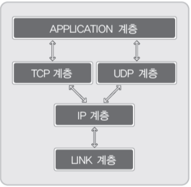
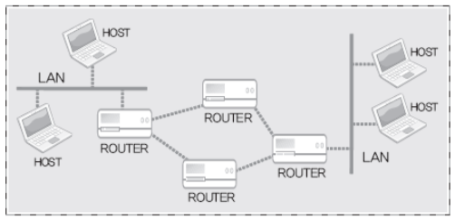
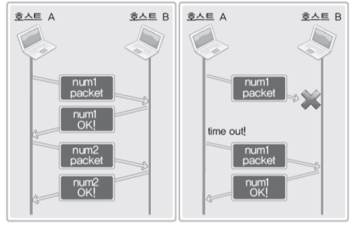

# 1. TCP와 UDP에 대한 이해

## TCP/IP 프로토콜 스택

### TCP/IP 프로토콜 스택이란?

- 인터넷 기반의 데이터 송수신을 목적으로 설계된 스택
- 큰 문제를 작게 나눠서 계층화 한 결과
- 데이터 송수신의 과정을 네 개의 영역으로 계층화 한 결과
- 각 스텍 별 영역을 전문화하고 표준화 함
- 7계층으로 세분화가 되며, 4계층으로도 표현함

## TCP 소켓과 UDP 소켓의 스택 FLOW
- TCP소켓: 링크-IP-TCP-APP
- UDP소켓: 링크-IP-TCP-APP

## LINK & IP 계층
### LINK 계층의 기능 및 역활
    - 물리적인 영역의 표준화 결과
    - LAN, WAN, MAN과 같은 물리적인 네트워크 표준 관련 프로토콜이 정의된 영역
    - 아래의 그림과 같은 물리적인 연결의 표준이 된다.
    

### IP계층의 기능 및 역활
    - IP는 Internet protocol을 의미함.
    - 경로의 설정과 관련이 있는 프로토콜

## TCP/UDP 계층

### TCP/UDP 계층의 기능 및 역할
- 실제 데이터의 송수신과 관련 있는 계층
- 그래서 전송(Transport) 계층이라고도 함.
- TCP는 데이터의 전송을 보장하는 프로토콜(신뢰성 있는 프로토콜),UDP는 보장하지 않는 프로토콜
- TCP는 신뢰성을 보장하기 때문에 UDP에 비해 복잡한 프로토콜이다.

TCP는 그림에서 보이듯이 확인의 과정을 거친다. 댸문에 신회성을 보장하지만, 그만큼 복잡한 과정을 거쳐서 데이터의 전송이 이루어진다.

## APPLICATION 계층

### 프로그래머에 의해서 완성되는 APPLICATION 계층

- 응용프로그램의 프로토콜을 구성하는 계층
- 소켓을 기반으로 완성하는 프로토콜을 의미함
- 소켓을 생성하면, 앞서보인 LINK, IP, TCP/UDP 계층에 대한 내용은 감춰진다.
- 응용프로그래머는 APPLICATION 계층의 완성에 집중하게 된다.
---

