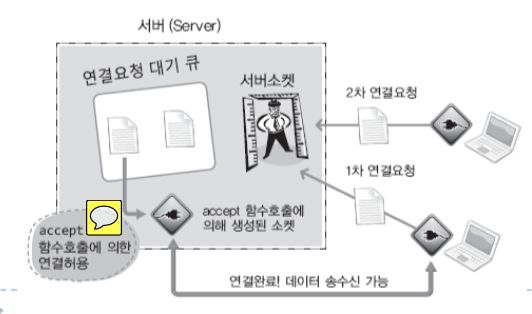
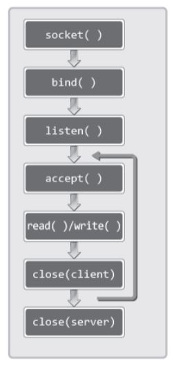

# 1. TCP와 UDP에 대한 이해

## TCP/IP 프로토콜 스택

### TCP/IP 프로토콜 스택이란?

- 인터넷 기반의 데이터 송수신을 목적으로 설계된 스택
- 큰 문제를 작게 나눠서 계층화 한 결과
- 데이터 송수신의 과정을 네 개의 영역으로 계층화 한 결과
- 각 스텍 별 영역을 전문화하고 표준화 함
- 7계층으로 세분화가 되며, 4계층으로도 표현함

## TCP 소켓과 UDP 소켓의 스택 FLOW
- TCP소켓: 링크-IP-TCP-APP
- UDP소켓: 링크-IP-TCP-APP

## LINK & IP 계층
### LINK 계층의 기능 및 역활
    - 물리적인 영역의 표준화 결과
    - LAN, WAN, MAN과 같은 물리적인 네트워크 표준 관련 프로토콜이 정의된 영역
    - 아래의 그림과 같은 물리적인 연결의 표준이 된다.
    

### IP계층의 기능 및 역활
    - IP는 Internet protocol을 의미함.
    - 경로의 설정과 관련이 있는 프로토콜

## TCP/UDP 계층

### TCP/UDP 계층의 기능 및 역할
- 실제 데이터의 송수신과 관련 있는 계층
- 그래서 전송(Transport) 계층이라고도 함.
- TCP는 데이터의 전송을 보장하는 프로토콜(신뢰성 있는 프로토콜),UDP는 보장하지 않는 프로토콜
- TCP는 신뢰성을 보장하기 때문에 UDP에 비해 복잡한 프로토콜이다.

TCP는 그림에서 보이듯이 확인의 과정을 거친다. 댸문에 신회성을 보장하지만, 그만큼 복잡한 과정을 거쳐서 데이터의 전송이 이루어진다.

## APPLICATION 계층

### 프로그래머에 의해서 완성되는 APPLICATION 계층

- 응용프로그램의 프로토콜을 구성하는 계층
- 소켓을 기반으로 완성하는 프로토콜을 의미함
- 소켓을 생성하면, 앞서보인 LINK, IP, TCP/UDP 계층에 대한 내용은 감춰진다.
- 응용프로그래머는 APPLICATION 계층의 완성에 집중하게 된다.
---

# 2. TCP기반 서버, 클라이언트의 구현.

## TCP서버의 기본적인 함수호출 순서


bind 함수까지 호출이 되면 주소가 할당된 소켓을 얻게된다. 따라서 listen 함수의 호출을 통해서 연결요청이 가능한 상태가 되어야 한다. 이번 장에서는 listen 함수의 호출이 의마하는 바에 대해서 주로 학습한다.

## 연결요청 대기 상태로의 진입
```c
#include<sys/type.h>

int listen(int sock, int backlog);
//성공시 0 실패시 -1 반환

```
- sock

    연결 요청 대기 상태에서 두고자 하는 소켓의 파일 디스크럽터 전달, 이 함수의 인자로 전달된 디스크럽터의 소켓이 서버 소켓(리스닝 소켓)이 된다.

- backlog

    연결요청 대기 큐(Queue)의 크기정보 전달, 5가 전달되면 큐의 크기가 5가 되어 클라이언트의 연결요철을 5까지 대기시킬 수 있다.


연결 요청도 일종의 데이터 전송이다. 따라서 연결요청을 받아들이기 위해서도 하나의 소켓이 필요하다. 그리고 이 소켓을 가리켜 서버소켓 또는 리스닝 소켓이라 한다. listen 함수의 호출은 소켓을 리스닝 소켓이 되게 한다.

## 클라이언트의 연결요청 수락

```c
#include<sys/socket.h>

int accept(int sock, struct sockaddr * addr, socklen_t * addrlen);
//성공 시 생성된 소켓의 파일 디스크럽터, 실패 시 -1 반환.
```
- sock

    서버 소켓의 파일 디스크럽터 전달.

- addr

    연결요청한 클라이언트의 주소정보를 담을 변수의 주소 값 전달. 함수호출이 완료되면 인자로 전달된 주소의 변수에는 클라이언트의 주소정보가 채워진다.

- addrlen

    두번째 매개변수 addr에 전달된 주소의 변수 크기를 바이트 단위로 전달, 단 크기정보를 변수에 저장한 다음에 변수의 주소 값을 전달한다. 그리고 함수 호출이 완료되면 크기정보로 채워져 있던 변수에는 클라이언트의 주소정보 길이가 바이트 단위로 계산되어 채워진다.



연결요청 정보를 참조하여 클라이언트 소켓과의 통신을 위한 별도의 소켓을 추가로 하나 더 생성한다. 그리고 이렇게 생성된 소켓을 대상으로 데이터의 송수신이 진행된다. 실제로 서버의 코드를 보면 소켓이 추가로 생성된 것을 알수 있다.

## TCP 클라이언트의 기본적인 함수 호출 순서
```c
#include<sys/socket.h>

int connect(int socket, const struct sockaddr * servaddr, socklen_t addrlen);
//성공 시 생성된 소켓의 파일 디스크럽터, 실패시 -1 반환
```
- sock

    클라이언트 소켓의 파일 디스크럽터 전달.
- servaddr

    연결 요청 한 클라이언트의 주소정보를 담을 변수의 주소 값 전달. 함수호출이 완료되면 인자로 전달된 주소의 변수에는 클라이언트의 주소정보가 채워진다.
- addrlen

    두 번째 매개변수 servaddr에 전달된 주소의 변수 크기를 바이트 단위로 전달. 단, 크기정보를 변수에 저장한 다음에 변수의 주소 값을 전달한다. 그리고 함수호출이 완료되면 크기정보로 채워져 있던 변수에는 클라이언트의 주소정보 길이가 바이트 단위로 계산되어 채워진다.


클라이언트의 경우 소켓을 생성하고, 이 소켓을 대상으로 연결의 요청을 위해서 connect 함수를 호출하는 것이 전부이다. 그리고 connect 함수를 호출 할 때 연결할 서버의 주소 정보도 함께 전달한다.


## TCP 기반 서버, 클라이언트의 함수호출 관계


확인할 사항은, 서버의 listen 함수호출 이후에야 클라이언트의 connect 함수호출이 유요하다는 점이다. 더불어 그 이유까지도 설명할 수 있어야 한다.

---

# 3. Iterative 기반의 서버, 클라이언트의 구현

## Iterative 서버의 구현


그림과 같이 반복적으로 accept 함수를 호출하면, 계속해서 클라이언트의 연결요청을 수락할 수 있다. 그러나 동시에 둘 이상의 클라이언트에게 서비스를 제공할 수 있는 모델은 아니다.


## Iterative 서버와 클라이언트의 일부

### 서버 코드의 일부
```c
for(i=0; i<5; i++){
    clnt_sock = accept(serv_sock, (struct sockaddr*)&clnt_adr, &clnt_adr_sz);
    if(clnt_sock == -1)
        error_handing("accept() error");
    else
        printf("Connected Client %d \n", i+1);

    while((str_len=read(clnt_sock, message, BUF_SIZE))!=0)
        write(clnt_sock, message, str_len);

    close(clnt_sock);
}
```

### 클라이언트 코드의 일부

```c
while(1){
    fputs("Input message(Q to quit): ", stdout);
    fgets(massage, BUF_SIZE, stdin);

    if(!strcmp(message, "q\n") || !strcmp(message, "Q\n"))
        break;
    
    write(sock, message, strlen(message));
    str_len = read(sock, message, BUF_SIZE-1);
    message[str_len] = 0;
    printf("Message from server: %s", message);
}
```

## 에코 클라이언트의 문제점

### 동작은 하나 문제의 발생 소지가 잇는 TCP 에코 클라이언트의 코드

```
write(sock, message, strlen(message));
str_len = read(sock, message, BUF_SIZE-1);
message[str_len] = 0;
printf("Message from server: %s", message);
```

TCP의 데이터 송수신에는 경계가 존재하지 않는다! 그런데 위의 코드는 다음 사항을 가정하고 있다.
> 한번의 read 함수 호출로 앞서 전송된 문자열 전체를 읽어 들일 수 있다.

그러나 이는 잘못된 가정이다. 왜냐하면 TCP에는 데이터의 경계가 존재하지 않기 때문에 서버가 전송한 문자열의 일부만 읽혀질 수도 있다.

# 4. 윈도우 기반으로 변경할 때 필요한 것

1. WSAStartup, WSACleanup 함수호출을 통한 소켓 라이브러리의 초기화와 헤제

2. 자료형과 변수의 이름을 윈도우 스타일로 변경하기

3. 데이터 송수신을 위해서 read, write 함수 대신 recv, send 함수 호출하기

4. 소켓의 종료를 위해서 close 대신 closesocket 함수 호출하기.

> 마치 공식을 적용하듯이(소스의 내용을 잘 모르는 상태에서도) 윈도우 기반으로 예제를 변경할 수도 있다. 그만큼 리눅스 기반 예제와 기반 예제는 동일하다!